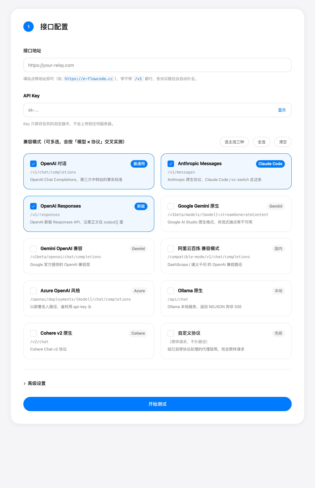
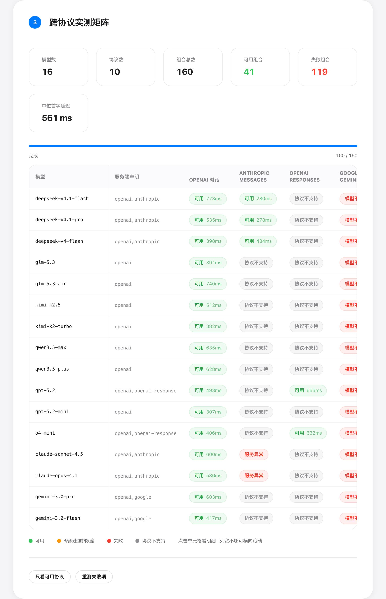
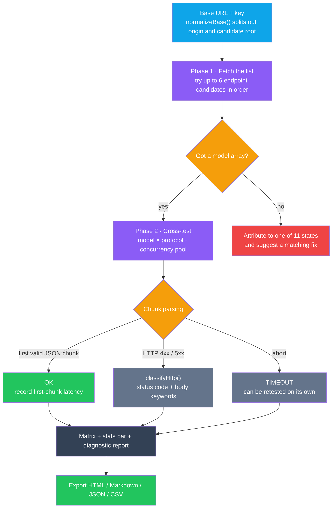
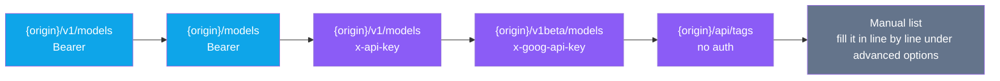

<p align="center"><a href="./README.md">简体中文</a> | <b>English</b></p>

<div align="center">


# APICompat

**Ask the server for its model list first, then test that list protocol by protocol · a zero-build / zero-dependency / zero-backend single-file static site**

Not "guess which model works", and not "paste one curl and see if it goes through" —
it pulls down the model list the site exposes, then runs a cross matrix over **10 protocols × every model**,
giving a status and a first-chunk latency per cell, and finally exports a diagnostic report you can send to someone.

[](https://apicompat.abobb.site)
[](#quick-start)
[](#project-structure)
[](#protocol-matrix)
[](#the-eleven-states)
[](#light-and-dark-follows-the-os-no-toggle)
[](#project-structure)

[Live Demo](https://apicompat.abobb.site) · [Preview](#preview) · [Protocol Matrix](#protocol-matrix) · [Test Flow](#test-flow) · [Quick Start](#quick-start) · [Engineering Notes](#engineering-notes-the-pitfalls)

</div>

---

## Preview

> Screenshots come from the live version. **The result matrix shot was staged against a local `tests/mock.py`** —
> 16 models, 10 protocols, 160 combinations, with real requests and real timing,
> only the upstream swapped for a fake relay, so no real quota got burned just for screenshots. The config panel shot is the live site as-is.

<table>
  <tr>
    <td width="50%" valign="top">
      
      <br><sub><b>Config panel</b> · enter the base URL + key, tick the protocols to test. Each of the 10 cards labels the endpoint it hits</sub>
    </td>
    <td width="50%" valign="top">
      
      <br><sub><b>Result matrix</b> · model × protocol, a status and first-chunk latency per cell; the "server-declared" column flags models where the declaration doesn't match the measurement</sub>
    </td>
  </tr>
</table>

---

## Table of Contents

- [What It Solves](#what-it-solves)
- [Protocol Matrix](#protocol-matrix)
  - [The Ten Protocols](#the-ten-protocols)
  - [The Eleven States](#the-eleven-states)
- [Test Flow](#test-flow)
- [Features](#features)
  - [Fetch the list first, then test](#fetch-the-list-first-then-test)
  - [First-Chunk Latency: The Bar for "Usable"](#first-chunk-latency-the-bar-for-usable)
  - [Sampling and Metering: the Capability Is There, the Controls Are Not](#sampling-and-metering-the-capability-is-there-the-controls-are-not)
  - [Timing Scope and Retries: Two Numbers That Have to Be Stated Plainly](#timing-scope-and-retries-two-numbers-that-have-to-be-stated-plainly)
  - [Light and Dark: Follows the OS, No Toggle](#light-and-dark-follows-the-os-no-toggle)
  - [Declared ≠ Observed](#declared--observed)
  - [Base URL Normalization: Whatever You Paste Works](#base-url-normalization-whatever-you-paste-works)
  - [Four Export Formats](#four-export-formats)
- [Quick Start](#quick-start)
- [Deployment](#deployment)
- [Project Structure](#project-structure)
- [Implementation Notes](#implementation-notes)
- [Tests](#tests)
- [Engineering Notes: The Pitfalls](#engineering-notes-the-pitfalls)
- [Limitations](#limitations)

---

## What It Solves

Third-party relays (the new-api / one-api kind) are everywhere now, but getting a straight answer about what they support is hard:

| Common approach | Where it breaks down |
|---|---|
| Read the site's docs | It says "OpenAI / Claude / Gemini compatible" but never says **which model** takes which route |
| Try one model once | It only proves **this one model × this one protocol** works; change the model or the protocol and it may all fall apart |
| Look at the `/v1/models` list | It only proves the endpoint exists, **not that any single model can actually answer** |
| Read `supported_endpoint_types` | Declarations often disagree with reality — the declaration is a handful, the measurement usually gets several more through |

This tool ties those four things into one: **list + matrix + timing + report**.

> **Why does it have to be pure front-end?** Because it uses your API key to hit your own upstream.
> Put any server in the middle and the key has to leave your browser first.
> There is no backend here — the page comes from static hosting, and from then on every request goes straight from your browser to the target site,
> so your data never leaves the machine. The cost is explicit: **the target site must allow cross-origin requests**, otherwise the browser blocks it (see [Limitations](#limitations)).

## Protocol Matrix

### The Ten Protocols

Basically every compatibility shape you meet in the wild is here. **Each one sends its requests independently, along its own path and with its own auth headers**,
not "hit them all as if they were OpenAI":

| | Protocol | Request endpoint | Auth | Notes |
|---|---|---|---|---|
| 1 | `openai` | `POST /v1/chat/completions` | `Authorization: Bearer` | The de-facto standard, supported almost everywhere |
| 2 | `anthropic` | `POST /v1/messages` | `x-api-key` + `anthropic-version`, **plus an extra `Authorization`** | Claude Code / cc-switch take this route |
| 3 | `openai-response` | `POST /v1/responses` | `Authorization: Bearer` | The new Responses API; content lives in `output[]` |
| 4 | `google` | `POST /v1beta/models/{model}:streamGenerateContent?alt=sse` | `x-goog-api-key` | AI Studio native format; falls back to non-streaming `:generateContent` if that fails |
| 5 | `google-openai` | `POST /v1beta/openai/chat/completions` | `x-goog-api-key` | The OpenAI compatibility layer Google ships |
| 6 | `dashscope` | `POST /compatible-mode/v1/chat/completions` | `Authorization: Bearer` | The compatibility path for Bailian / Qwen |
| 7 | `azure` | `POST /openai/deployments/{model}/chat/completions?api-version=2024-02-01` | `api-key` | The deployment name goes in the path, not the body |
| 8 | `ollama` | `POST /api/chat` | none | Local service; replies with **NDJSON, not SSE** |
| 9 | `cohere` | `POST /v2/chat` | `Authorization: Bearer` | Cohere Chat v2 |
| 10 | `custom` | **request sent as-is, no path appended** | `Authorization: Bearer` | Catch-all for proxy layers that handle protocols themselves; the response format is auto-detected |

> Why does the `anthropic` row **send the key twice**? We've measured sites that only accept `x-api-key` and sites that only accept `Authorization`;
> sending both is the widest-compatibility option right now, at the cost of one extra header field.

### The Eleven States

"Failed" isn't enough information — a red cross might mean your key is wrong, or that this model has no channel in the free group.
So every cell lands in one of 11 states. They're listed below by their **internal key** — the UI and the exported report render the label in Chinese:

| State | How it's decided | What you should do |
|---|---|---|
| **OK** | A valid streaming chunk arrived | — |
| **WARN** | The request succeeded, but no valid chunk was parsed | Retry with a larger `max_tokens` |
| **TIMEOUT** | No first chunk within the configured timeout | Raise the timeout or switch protocol |
| **RATELIMIT** | HTTP 429 | Check your quota or lower the concurrency |
| **NOCHANNEL** | HTTP 503, or the body contains "无可用渠道 / no available channel / distributor" | This model really has no channel in the current group — not your problem |
| **NOTFOUND** | HTTP 404, or 400 with a body containing "not found / does not exist / 不包含" | The model name is misspelled |
| **UNSUPPORTED** | The body contains `unsupported_endpoint` / `not implemented` / `convert_request_failed` / `不支持` | This route doesn't work — try another |
| **UNAUTH** | HTTP 401 / 403 | The key expired or was banned |
| **NETWORK** | `fetch` throws outright (not an abort from a timeout) | The site doesn't allow CORS, or the address is unreachable |
| **SERVER** | HTTP 5xx | The upstream itself is down — retest later |
| **UNKNOWN** | Anything else | Open it and read the raw response |

> This classification is **order-sensitive**: 401/403 first, then 404, 429, 503,
> and only then the body keywords. Plenty of relays tuck "model not found" inside a 400,
> so looking at the status code alone would label them all `UNKNOWN`.

## Test Flow



The list endpoint isn't a single attempt either. Candidates are tried in order, and whichever returns valid JSON first wins:



> The bar is "**does the response contain a model array**", not "HTTP 200".
> Some sites return 200 plus an HTML homepage for unknown paths; those are always treated as unsupported,
> and it says so outright — "returned an HTML page, not an API" — otherwise you'd quietly end up with an empty list.

## Features

| | Feature | In one line |
|---|---|---|
| 🔎 | **List first, test second** | Pull the visible models from the site, then verify them protocol by protocol, instead of typing model names by hand |
| 🧩 | **Ten protocols, ten independent request shapes** | Paths, auth headers and body shapes all follow each protocol's own rules, instead of an OpenAI template |
| ⏱ | **First-chunk latency only, never a faked total time** | Streaming aborts on the first chunk so it burns no tokens — no total time for streaming; non-streaming gets response time |
| 🔢 | **Multi-round sampling, off the UI** | Hit the same cell N times; **status by mode, latency by median**, jitter alongside. No control on the page — open with `?samples=3` |
| 📏 | **Metering mode, off the UI** | Keep reading past the first chunk for characters/sec, counted **separately** from first-chunk latency. Open with `?meter=1` |
| 🎯 | **Eleven-state attribution** | Tell "your key is broken" apart from "this model has no channel" |
| ⚖️ | **Declared vs. observed, side by side** | Put `supported_endpoint_types` next to what actually got through; flag mismatches in yellow |
| 🚀 | **Tunable concurrency / timeout / retries** | 6 concurrent by default; measured to be an order of magnitude faster than serial |
| ↻ | **Retry cost on display** | Cells that only passed after a retry carry ↻, with the first attempt's duration and backoff spelled out |
| 🔁 | **Retest failures only** | A flaky upstream doesn't force a full rerun |
| 🌗 | **Light / dark follows the OS** | No toggle, nothing persisted; set the OS to dark and the page follows, with `color-scheme` declared alongside |
| 📊 | **Four export formats** | HTML (send it straight to someone) / Markdown (paste into an issue) / JSON (feed to scripts) / CSV |

### Fetch the list first, then test

Typing model names by hand is the easiest step to get wrong — one character off and the result is `NOTFOUND`,
with no way to tell whether the name was wrong or the site simply doesn't have it.

So the flow is reversed: **GET the list first, then use the returned ids verbatim**.
If the list carries `supported_endpoint_types`, that gets its own column in the matrix;
tick "only test declared protocols" and you can cut the combinations from 160 down to a few dozen, saving time and quota.

### First-Chunk Latency: The Bar for "Usable"

The probe sends streaming requests (`stream: true`), but **"we got the first byte" is not the success bar**:

| Approach | Problem |
|---|---|
| Status code only | Some sites return 200 first and then spit an error into the stream |
| "There are bytes" only | Heartbeats and empty SSE comments get counted as success |
| **"Did a valid JSON chunk parse"** | ✅ this is the one we use |

Reasoning models have a trap: with too small a `max_tokens`, they spend it all on thinking and return an empty string as the content.
Checking "content is non-empty" would misjudge them as failures, so the bar stops at **whether the chunk is valid**,
and `max_tokens` is set to 512 to leave headroom.

### Sampling and Metering: the Capability Is There, the Controls Are Not

**A single sample measures an instant, not a combination.** A cell's latency swinging 300–400 ms is ordinary —
treating one run as the verdict is the same mistake as judging a node dead from a single ping.
So a cell can be hit N times in a row (1–5):

| | How it's reduced | Why |
|---|---|---|
| Status | **mode** | "two passes and one timeout" should read as usable, not timeout |
| Latency | **median** | the mean gets dragged off by a single 8-second blip |
| Jitter | slowest − fastest | puts the spread on the table instead of making you guess |

Ties go to the **more usable** state (usable > degraded > timeout). Consecutive samples are 150 ms apart —
firing them back to back samples the same instant and wastes the round. The cell prints the median;
hovering reveals each sample's first-chunk latency and the jitter.

**Metering mode answers a different question: how fast does this site emit text?**
Fast mode aborts on the first chunk (saving quota), and the price is that you learn "does it work"
but not "is it pleasant to use". Metering mode keeps reading past the first chunk, up to
**64 data chunks or 6 seconds** (whichever comes first), and then:

```
output speed = characters received after the first chunk ÷ time elapsed after the first chunk
```

Three deliberate choices:

- **Both numerator and denominator start after the first chunk.** First-chunk latency is *waiting*
  and output speed is *producing*; adding them means nothing, so waiting time never enters the denominator.
  The report prints the two figures in adjacent columns rather than blending them into one "score".
- **A single chunk yields no speed.** With a zero denominator we leave it blank rather than print a plausible-looking
  "0 chars/sec" — which would read as "this site emits nothing" when the window was merely too short.
- **The timeout window is reset once while draining.** Otherwise "first chunk took 25 s, then 6 more s of reading"
  gets misjudged as a timeout by the 30-second total.

> **Neither of these is turned into a UI control.** Both multiply request count and quota (sampling ×N,
> metering reads a few dozen extra chunks after the first one), and most people opening this page
> just want to know whether it works — there is no reason to put two expensive switches on the default path.
> So the default setup is pinned to **1 sample + fast mode** (zero extra requests, zero extra quota),
> and you open the heavier setup from the address bar when you need a firmer conclusion:
>
> | Parameter | Effect |
> |---|---|
> | `?samples=3` | Hit each cell 3 times (max 5); latency by median, status by mode, jitter reported |
> | `?meter=1` | Metering: keep draining to 64 chunks / 6 s past the first chunk for a real output speed |
>
> They stack (`?samples=3&meter=1`). With them on, the matrix gains an output-speed column, cell tooltips spell out
> the sample count and each sample's first-chunk latency, and the overview gains a "measurement setup" row.
> **With the default setup none of that appears** — the UI is **pixel-identical** to the no-parameter version
> (verified with a full-page pixel diff when this capability was ported back; see the engineering notes).

### Timing Scope and Retries: Two Numbers That Have to Be Stated Plainly

**Streaming only reports first-chunk latency.** The probe calls `abort()` the moment it parses the first valid chunk
(otherwise every test quietly burns 512 tokens), which means that instant is both "the first chunk arrived"
and "the request ended". Printing it as "total time" is a lie — the same number cannot be both the start and the end. So:

- a streaming cell reports first-chunk latency only, and the detail popup says
  "streaming: aborts on the first data chunk, so total time is not measured";
- non-streaming responses (which arrive in one piece) get "response time", labelled as such.

**A retry has to be reported together with what it cost.** The default retry count is 1, and after a successful retry
the tool holds the result of the **last** attempt: if the first one hit a timeout (possibly a full 30 seconds)
and the retry succeeded in 200 ms, the cell would show nothing but a pretty 200 ms.
That is the same trick as "retry until success and only display the successes", so now:

- a cell that only passed on retry carries a **↻** marker, and hovering shows the first attempt's status and duration;
- the detail popup lists "attempts", "first attempt" and "backoff wait";
- the completion banner separately reports "N usable combinations only passed after a retry";
- the JSON export carries `attempts` / `retried` / `retryWaitMs` / `firstAttemptMs`.

> In one line: the latency in a cell comes from the attempt that succeeded, but **the cost paid before the retry is never hidden**.

### Light and Dark: Follows the OS, No Toggle

There is **no theme button on the page**. Light and dark follow the OS `prefers-color-scheme` only:
switch the OS to dark and the page goes dark. Dropping the toggle also drops three problems — nothing to
remember about "what I picked last time", no "I clicked it but it flipped back on another machine",
and no synchronous script in `<head>` racing the first frame.

The mobile address bar follows too, via two system-split `theme-color` metas:

```html
<meta name="theme-color" media="(prefers-color-scheme:light)" content="#f5f5f7">
<meta name="theme-color" media="(prefers-color-scheme:dark)"  content="#101013">
```

A few things that aren't obvious:

- **Dark isn't an inversion of light**, it's its own set of values: the background isn't pure black
  (`#000` with light text smears on OLED), it's `#101013`; the accent moves from Apple blue `#007aff`
  **up** to `#0a84ff` (in light mode hover *darkens* to `#0051d5`, but in dark mode it has to *lighten*
  to `#409cff`, because the original blue sinks into a dark ground); and borders go from
  `rgba(0,0,0,.08)` to `rgba(255,255,255,.10)` — skip that and the edges simply vanish.
- **Every hard-coded color is collapsed into variables.** Dark only overrides values and touches no rules —
  otherwise some corner (a table header, a checkbox, the popup, a secondary button) always leaks a bright patch.
  The overrides sit in one `@media screen and (prefers-color-scheme:dark)` block at the end of the stylesheet;
  `screen` keeps `@media print` on the light palette, so printing on a dark system doesn't yield grey-on-grey.
- **`color-scheme` has to be declared too** (`:root{color-scheme:light dark}`), or the browser's native widgets
  (scrollbars, number-input spinners, the `<select>` dropdown, autofill backgrounds) won't follow.
- **Exported reports follow as well.** The HTML report is a standalone file that doesn't carry the main stylesheet,
  so it writes its own dark overrides — it has to follow the **recipient's** OS, not the one you exported on.

### Declared ≠ Observed

This is the most interesting column in the tool. The server's `supported_endpoint_types` is the declaration,
the green cells in the matrix are the measurement — when the two disagree, they get listed separately:

- **Declared supported but not usable** — `anthropic` is in the declaration, but a real request comes back 400
- **Not declared but usable anyway** — only `openai` was declared, yet the `dashscope` compatibility path works too

> Drift like this is common on relays, because they only route by "model group",
> and many models are really aliases of the same upstream. **Measurements beat declarations**, but don't rush to a conclusion —
> hit "retest failures" first; upstream flakiness is more frequent than you'd think.

### Base URL Normalization: Whatever You Paste Works

When you copy a URL out of some docs, the clipboard can hold just about any shape. All of these get stripped down before testing:

| What you paste | What actually gets tested |
|---|---|
| `https://api.example.com` | tries both `/v1/chat/completions` and `/chat/completions` |
| `https://api.example.com/v1` | joins under `/v1` |
| `https://api.example.com/v1/chat/completions` | strips the trailing protocol path and falls back to the origin |
| `https://api.example.com/v1beta/models` | same as above; `/models` gets stripped |
| `https://xxx.com/openai/deployments/gpt-4/chat/completions` | stripped to the origin; the Azure row builds its own path back up |
| `https://api.example.com/#/` | drops everything after `#` first |

### Four Export Formats

| Format | What it's for |
|---|---|
| **HTML** | A self-styled one-page report you can send straight to someone |
| **Markdown** | Paste into an issue / PR / group chat; tables keep their shape |
| **JSON** | Feed to scripts for trend comparison |
| **CSV** | Drop into spreadsheet software to sort and filter |

All four formats carry the same disclaimer, and the report footer also records which site was tested and when.
**The measurement setup of that run** (samples, fast/metering mode, drain cap, concurrency, timeout, retries)
also goes into the Markdown header, the HTML report overview and the JSON `setup` field —
whoever receives a CSV should be able to answer "where did this 42 chars/sec come from",
rather than only seeing the outcome. Under the default setup (1 sample + fast mode) the speed column and the
setup row aren't rendered at all — every character in the report corresponds to something the page actually showed.

## Quick Start

**No `npm install`, no bundling, no dependencies whatsoever.** One file, double-click and go:

```bash
# serve it properly (recommended; some browsers restrict fetch harder under file://)
python3 -m http.server 8788
# then open http://127.0.0.1:8788
```

You can also just double-click `index.html` — the styles and scripts are all inlined in that one file, and the page requests no external resources.

Using it takes three steps:

```text
1. Fill in the Base URL and API Key   →  https://your-relay.example.com/v1
2. Tick the protocols to test (the three most common are ticked by default: OpenAI Chat / Anthropic Messages / OpenAI Responses)
3. Click "probe all protocols"  →  watch the matrix fill in cell by cell
```

> ⚠️ **Do create a fresh, low-quota key for this**, and delete it right after.
> A full-protocol probe sends one request per model × protocol,
> which runs into the hundreds of calls when you have many models — using your main key against a production account is not a good idea.

## Deployment

A purely static artifact — drop it anywhere:

| Platform | Configuration |
|---|---|
| **Vercel** | Framework Preset `Other`; leave Build Command and Output Directory empty |
| **Cloudflare Pages** | Leave the build command empty, set the output directory to `/` |
| **GitHub Pages** | Settings → Pages → Source: pick the branch root |
| Local | `python3 -m http.server`, or just double-click |

The live copy runs on Vercel behind the `apicompat.abobb.site` domain:

```bash
# the project root is the deployable artifact
vercel deploy --prod
```

## Project Structure

```
.
├── index.html              # all styles and logic, no external requests, 134 KB / 3236 lines
├── robots.txt
├── docs/
│   ├── images/             # README header logo
│   └── screenshots/        # config panel and the result matrix
└── tests/
    ├── mock.py             # fake relay: 16 models × 10 protocols, Python standard library only
    ├── smoke.mjs           # end-to-end assertions (Playwright, 58 of them)
    └── run.sh              # start mock → run assertions → done
```

**Having only one `index.html`** is deliberate: hand it to a colleague, drop it on a USB stick, attach it to an email — no directory to carry along.
The price is that the file can't afford to grow fat — no icon font, no icon bitmaps, no standalone favicon file.
Every graphic on the page (status pills, colour bars, checkboxes, the step dots) is drawn in CSS.
The one inlined binary is the favicon: 16 and 32 px, folded into `data:` URIs inside the `<head>`
**precisely so it does not become a `favicon.ico`** — as a separate file the browser fetches it on every page load,
and a `file://` double-click may not get it at all.
So dropping the previous version's "trace a bitmap to vectors, then inline it as a mask" icon set took the file from
158 KB down to 131 KB, and the two favicon sizes bring it back to 134 KB (about 3.7 KB net) — while this version has
**more** capability than the last one (sampling and metering, just kept off the UI).

## Implementation Notes

- **The bar is "a valid chunk parsed", not "HTTP 200"**: the `ok` / `text` function families are written per protocol,
  each recognizing its own response shape (OpenAI's `choices[]`, Anthropic's `content[]`,
  Gemini's `candidates[].content.parts[]`, Ollama's NDJSON `message`, Cohere's `content-delta`),
  while the `custom` protocol tries all six shapes in turn.
- **The concurrency pool is a hand-written 6 lanes**, not a `Promise.all` free-for-all —
  `Promise.all` would fling hundreds of requests out at once, the upstream would rate-limit immediately, and everything would come back 429.
- **Only "worth retrying" gets retried**: network blips, timeouts and 5xx are retried with backoff;
  deterministic failures like 401 / 404 / unsupported protocol are not, saving time and quota.
- **Anything read out of `localStorage` is sanitized as untrusted input**: the key is only persisted when "remember" is ticked,
  and corrupted config must never be allowed to break the page — every field goes through a type and range check,
  and anything missing falls back to a default.
- **The two expensive switches live in URL parameters, not on the UI**: `probeSettings` parses `?samples=` / `?meter=`
  out of `location.search`, and falls back to the default (1 sample + fast mode) when it can't. That makes
  "capability present, controls absent" a structural fact rather than a comment convention — there is literally
  nothing to click. Every new piece of copy (the speed column, the tooltip scope, the overview setup row, the speed
  fields in the report) hangs off a condition, so none of it renders under the default parameters.
- **Light and dark follow the OS only, nothing persisted**: `:root` carries the light values, and one
  `@media screen and (prefers-color-scheme:dark)` block at the end of the stylesheet overrides the same variable names.
  No JS is involved, so there's no window where "the script hasn't run yet" flashes a light page —
  the previous version's toggle needed a synchronous script in `<head>` to beat the first frame, and that whole block is gone.
  `:root{color-scheme:light dark}` brings scrollbars and native dropdowns along.
- **Only 4 font sizes**: 12 / 14 / 18 / 22px (`--fs-sm` → `--fs-xl`). Apart from the `html{font-size:16px}` root
  baseline, the main stylesheet carries no hard-coded `font-size`; the standalone stylesheet in exported reports
  follows the same ladder. Same for colors — no rules carry raw hex.

## Tests

`tests/mock.py` starts a fake relay (**16 models × 10 protocols, Python standard library only, zero dependencies**),
and deliberately keeps a few shapes you meet in the real world: declarations that disagree with measurements, three endpoints that always 404,
and a different first-chunk latency range per protocol. That way the whole chain can run **without burning any real quota**.

```bash
# one shot: start mock → run assertions → clean up
bash tests/run.sh

# or manually
python3 tests/mock.py 8788 &
node tests/smoke.mjs

# or run it against the live site: pointing BASE off-machine switches to "live mode",
# which runs only the 17 assertions that don't need an upstream
# (hero + theme splitting + file:// double-click) and sends no probe requests
BASE=https://apicompat.abobb.site node tests/smoke.mjs
```

**Two modes**: BASE on this machine (the default `127.0.0.1:8788`) runs everything; pointing it anywhere else
switches to live mode. There's no fake relay out there, so a full run would fire 160 doomed real requests at the
live site — proving nothing and polluting their logs. Hence live mode runs only the "page itself" sections.
One trap worth noting: the live site sits behind Cloudflare, whose edge injects an analytics script from
`static.cloudflareinsights.com`; when it can't be reached locally the browser logs a "Failed to load resource" —
so **the criterion is which origin the error came from**, and only same-origin errors count against the page.

Coverage falls into these buckets: hero rendering and the protocol-card four-piece set, list fetching, matrix dimensions and stats consistency,
the cell-detail popup and its timing scope, **retry cost made visible**, the "only usable protocols" filter,
the four exports being non-empty, no horizontal overflow at the 390 / 768 / 1024 breakpoints,
and double-click opening over `file://` — plus two assertions that guard what must **not** be on the page
(the theme toggle, the sampling/metering controls). Things deliberately removed get their absence pinned as an
assertion, so nobody quietly adds them back later. Then two more that watch a **promise** instead of a feature:
that the favicon really is a **decodable** PNG data URI, and that the page issues no external resource request at all —
the latter being exactly the sentence above, which nobody would otherwise be checking.

**58 assertions in total; against `tests/mock.py` it's 58 passed / 0 failed,
and against the live site it's 19 passed / 0 failed (live mode runs only the sections that need no upstream).**

```
PASS  page loads with no console errors
PASS  renders 10 protocol cards
PASS  only the 3 main protocols are ticked by default
PASS  every protocol card carries name / tag / path / scenario note
PASS  footer is the pure-front-end notice
PASS  there is no theme toggle button on the page
PASS  there are no sample-count or probe-mode controls on the page
PASS  the favicon is two inline PNG data URIs (16 / 32) and both decode
PASS  the page issues no external resource request (the icon is inline too)
PASS  full-protocol probe finishes
PASS  model list fetched (16 visible models)
PASS  matrix row count = model count
PASS  matrix column count = models + declared + 10 protocols
PASS  matrix cells = 16 × 10
PASS  stats bar "total combinations" is self-consistent
PASS  usable combinations exist and match the stats
PASS  legend has all four colors
PASS  diagnostic report generated (with protocol pass rate and conclusion)
PASS  clicking a cell opens the detail popup (with first-chunk latency and timing scope)
PASS  the detail popup no longer mislabels first-chunk latency as "total time"
PASS  "only usable protocols" filter applies and can be undone
PASS  HTML export is non-empty
PASS  Markdown export is non-empty
PASS  JSON export is non-empty
PASS  CSV export is non-empty
PASS  the second round (retries=1) finishes
PASS  a cell that only passed on retry carries the ↻ marker
PASS  the ↻ tooltip spells out what the first attempt cost
PASS  the completion banner reports how many combinations needed a retry
PASS  the detail popup shows "attempts" and "first attempt"
PASS  JSON export contains attempts / retried / timingScope
PASS  JSON export no longer contains the misleading totalMs field
PASS  no horizontal overflow at 390px
PASS  no horizontal overflow at 768px
PASS  no horizontal overflow at 1024px
PASS  the page background follows the OS in light mode
PASS  body text contrast is right in light mode
PASS  no JS-settled theme attribute when the OS is light
PASS  two system-split theme-color metas in light mode
PASS  the page background follows the OS in dark mode
PASS  body text contrast is right in dark mode
PASS  no JS-settled theme attribute when the OS is dark
PASS  no bright-background elements are left in dark mode
PASS  two system-split theme-color metas in dark mode
PASS  ?samples=4&meter=1 is parsed into the internal setup
PASS  out-of-range clamps to the cap, unrecognized values read as off
PASS  with no parameters it's the zero-overhead default setup
PASS  with 3 samples the matrix still has 16 cells
PASS  the cell tooltip states the sample count and each run's latency
PASS  the detail popup gives the sample count and "median within the cell"
PASS  the completion banner says how many samples per cell this round used
PASS  every usable cell carries a speed in metering mode
PASS  the output speed lands in the mock's range (≈40 chars/sec)
PASS  the tooltip spells out how the speed was computed
PASS  the detail popup explains the metering scope
PASS  the stats bar gains "median output speed"
PASS  the JSON export carries the measurement setup and the new metrics
PASS  file:// double-click works (protocol cards and scripts are both there)

====================================================
  58 passed, 0 failed
====================================================
```

> The theme assertions don't click a button — they open **one page per `colorScheme`** (`light` / `dark`) and
> measure the background, the body-text contrast and the `meta[theme-color]` set, then confirm the page carries
> **no `data-*` theme attribute at all**. With the toggle gone, an assertion can't pretend there's something to click.
> The sampling/metering assertions first verify the URL-parameter parsing (out-of-range and unrecognized values included),
> then drive two real runs by mutating the internal setup object — because **the URL parameters are the only entry point**
> to these capabilities, and skipping that would leave the README claiming something nothing verifies.
> The retry assertions are triggered by two combinations in the mock relay that return 500 on every other hit
> (`GET /__reset` clears the counters); the metering assertion relies on the mock actually emitting text character by
> character (24 chunks × 50 ms ≈ 40 chars/sec, and the assertion requires the measurement to land between 20 and 90).
> In other words both "only passed on retry" and "is the output speed computed correctly" are **actually tested**,
> not just written. Playwright is required: `npm i -D playwright && npx playwright install chromium`.

## Engineering Notes: The Pitfalls

**1. Give a reasoning model too small a `max_tokens` and it returns empty content.**
The first version treated "content is non-empty" as the success criterion, and a whole batch of thinking models got marked as failures.
Switching to "did a valid chunk parse" fixed it.

**2. Vertical table headers were a bad idea.**
With many matrix columns, rotating the protocol names 90° does save width — but Chinese set on a slant is brutally hard to read on screen,
and row height got dragged out to 128px. Going back to horizontal headers that are allowed to wrap brought the header down to 35px.

**3. `white-space: nowrap` blows the grid columns apart.**
The protocol card's path was originally a single-line ellipsis, and on a 390px phone it pushed the grid into a horizontal scrollbar
(`scrollWidth 409 > 390`). The cause: **the max-content width of nowrap text counts toward a grid item's automatic minimum size**,
and adding `min-width: 0` to a flex item only affects shrinking — it doesn't cancel that contribution.
The fix is `grid-template-columns: minmax(0,1fr) auto` on the container, or simply letting the path wrap.

**4. "Select all" ticks the custom protocol too.**
With no URL filled in, hitting start just throws an `alert` and bails —
and in automated tests `alert` is auto-dismissed by default, so it presented as "clicking does nothing". Took a long time to track down.

**5. Some sites return 200 + the homepage HTML for paths that don't exist.**
Look at the status code alone and you'd quietly get an empty list. It now detects the HTML body and reports "returned an HTML page, not an API".

**6. "Port the capability back but don't change the UI by one pixel" — prove it with a pixel diff, not with your eyes.**
This round's redesigned UI had dropped multi-round sampling and metering mode. They had to come back, but no new control
could appear on the page. "Looks the same to me" doesn't count: shoot the **whole page** with Playwright at
1440×960 / DPR 2 before and after the port, then compare pixel by pixel with `ImageChops.difference` —
under the default setup all 8,605,440 pixels are identical, and only then can you claim the UI is unchanged.
The technique itself is nothing clever: the new code runs entirely through conditionals, so under the default
parameters not one node or string is rendered. Then pin "there are no such controls on the page" as a test assertion,
so nobody adds them back by reflex later.

**7. `boundingBox()` returns viewport coordinates; `fullPage + clip` wants document coordinates.**
Shooting `#panel-report` after the page had already been scrolled, using `boundingBox()` directly as `clip`,
produced a misaligned crop. Under `fullPage: true` the `clip` is measured in **document** coordinates, while
`boundingBox()` gives the position within the **current viewport** — the difference is exactly `window.scrollY`.
Using `el.getBoundingClientRect().top + window.scrollY` lines it up.
(A cousin of the same trap: calling `boundingBox()` and *then* scrolling the page — the scroll invalidates that coordinate.)

**8. When the DOM shape changes, fix the assertion first — don't rush to suspect the feature.**
The `.rt` (retry marker) tooltip used to live on the marker itself; once a cell had to state three things at once
(how many samples / what the retry cost / the output speed), the tooltip moved up to the outer `.mcell`.
The assertion still read `marked[0].getAttribute('title')`, so it read an empty string.
**The check has to follow the DOM**: switching to `marked[0].closest('.mcell')` turned it green immediately.
Failures like this look like "the feature broke" when really the subject changed shape — check first whether
the assertion is still watching the node it thinks it is.

## Limitations

- **The target site must allow cross-origin requests (CORS).** Browser-direct is both the feature and the shackle:
  if the site doesn't send `Access-Control-Allow-Origin`, it simply cannot be tested — that's the browser's rule and there's no way around it.
  It's also why "network/CORS" and "unreachable address" collapse into one state — from the front end they look identical.
- **Only requests a browser can send can be tested.** Some protocols require custom TCP, mTLS or client certificates — not possible here.
- **Latency numbers are affected by your network** and are not the server's real processing time. Inflated numbers when testing across regions are normal.
- **The matrix only reflects the moment you tested.** Upstream channels change, quota runs out, models get added —
  a red cell doesn't mean the model will never work; run a few more rounds before concluding.
- **No scheduled health checks.** Those would mean storing historical results somewhere, and "nothing stored server-side" is a premise of this project.
  If you want trend comparison, accumulate JSON exports yourself.
- **Multi-round sampling multiplies the request count by N.** 16 models × 10 protocols × 3 samples = 480 requests —
  which is exactly why it's off by default and only reachable through `?samples=`. If you do turn it on,
  tick "only test declared protocols" first to shrink the combination count.
- **Metering mode costs more quota than fast mode.** It keeps reading past the first chunk (up to 64 chunks or 6 seconds)
  in exchange for the extra "output speed" dimension. If all you want is "does it work", the default fast mode is enough.

---

## Disclaimer

This project is a **pure front-end** tool: every request goes from your browser straight to the target address you entered, never through any intermediate server.

To prevent API key leakage, please **do create a fresh, low-quota key** for testing, and **delete it immediately** when you're done;
the author accepts no responsibility for leaked keys, lost quota or any other consequences of using this tool.

The icon is free artwork from [icons8](https://icons8.com); its licence requires attribution.
