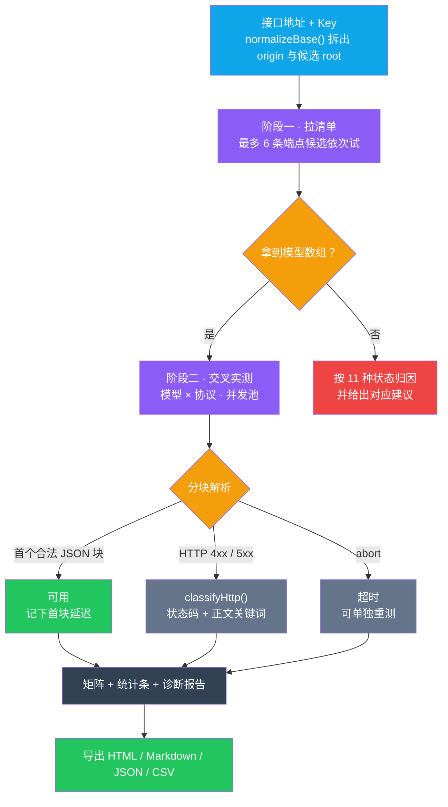
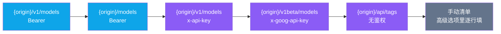

<p align="center"><b>简体中文</b> | <a href="./README.en.md">English</a></p>

<div align="center">

<picture>
  <source media="(prefers-color-scheme: dark)" srcset="./docs/images/logo-white.png" />
  
</picture>

# APICompat

**先问服务端要清单，再拿清单逐个协议实测 · 零构建 / 零依赖 / 零后端的单文件静态站**

不是「猜哪个模型能用」，也不是「贴一次 curl 看通不通」——
它先把站点可见的模型清单拉下来，再用 **10 种协议 × 全部模型**跑一遍交叉矩阵，
逐格给出状态与首块延迟，最后导出成一份能发出去的诊断报告。

[](https://apicompat.abobb.site)
[](#快速开始)
[](#项目结构)
[](#协议矩阵)
[](#十一种状态)
[](#项目结构)

[在线体验](https://apicompat.abobb.site) · [预览](#预览) · [协议矩阵](#协议矩阵) · [实测流程](#实测流程) · [快速开始](#快速开始) · [工程笔记](#工程笔记那些踩过的坑)

</div>

---

## 预览

> 截图取自线上运行版本。**结果矩阵与报告那几张是在本地 `tests/mock.py` 上取的景** ——
> 16 个模型、10 种协议、160 个组合，跑的是真实请求与真实计时，
> 只是上游换成了假中转站，免得为了截图去烧真实额度。首屏与移动端是线上原样。

<table>
  <tr>
    <td width="50%" valign="top">
      
      <br><sub><b>配置面板</b> · 填地址 + Key，勾要测的协议。10 张卡各自标着打的是哪个端点</sub>
    </td>
    <td width="50%" valign="top">
      
      <br><sub><b>结果矩阵</b> · 模型 × 协议逐格出状态与首块延迟；「服务端声明」列标出声明与实测不符的模型</sub>
    </td>
  </tr>
  <tr>
    <td width="50%" valign="top">
      
      <br><sub><b>单格明细</b> · 点任意一格看到实际请求地址、响应方式、首块延迟，以及这一格是否需要重试</sub>
    </td>
    <td width="50%" valign="top">
      
      <br><sub><b>诊断报告</b> · 协议通过率、完全不可用 / 全量通过、声明与实测不符、推荐首选</sub>
    </td>
  </tr>
</table>

<div align="center">


<br><sub><b>移动端</b> · 390px 下一列铺开；矩阵横向可滚，模型列冻结</sub>

</div>

---

## 目录

- [它解决什么问题](#它解决什么问题)
- [协议矩阵](#协议矩阵)
  - [十种协议](#十种协议)
  - [十一种状态](#十一种状态)
- [实测流程](#实测流程)
- [特性](#特性)
  - [先拿清单，再谈实测](#先拿清单再谈实测)
  - [首块延迟：判定「能用」的口径](#首块延迟判定能用的口径)
  - [计时口径与重试：两个数必须说清](#计时口径与重试两个数必须说清)
  - [声明 ≠ 实测](#声明--实测)
  - [地址归一化：贴什么进来都能认](#地址归一化贴什么进来都能认)
  - [四种导出](#四种导出)
- [快速开始](#快速开始)
- [部署](#部署)
- [项目结构](#项目结构)
- [实现要点](#实现要点)
- [测试](#测试)
- [工程笔记：那些踩过的坑](#工程笔记那些踩过的坑)
- [限制](#限制)

---

## 它解决什么问题

第三方中转站（new-api / one-api 那一类）越来越普遍，但它们「支持什么」很难问清楚：

| 常见做法 | 卡在哪 |
|---|---|
| 看站点文档 | 写的是「兼容 OpenAI / Claude / Gemini」，没说**具体到哪个模型**走哪条路 |
| 拿一个模型试一次 | 只能证明**这一个模型 × 这一种协议**通；换个模型或换个协议可能全崩 |
| 看 `/v1/models` 列表 | 只证明这个端点存在，**不证明任何一个模型真的能回话** |
| 读 `supported_endpoint_types` | 声明经常与实测不符 —— 声明一只手数得过来，实测往往能多跑通几条 |

这个工具把上面四件事串成一件事：**清单 + 矩阵 + 计时 + 报告**。

> **为什么必须是纯前端？** 因为它要拿你的 API Key 去打你的上游。
> 只要中间有任何一台服务器，Key 就得先离开你的浏览器。
> 这里没有任何后端 —— 页面从静态托管取回来，之后每一条请求都是你的浏览器直连目标站点，
> 数据全程不出本机。代价也很明确：**目标站点必须允许跨域**，否则浏览器会拦下来（见[限制](#限制)）。

## 协议矩阵

### 十种协议

市面上常见的兼容形态基本都在这儿了。**每一种都按它自己的路径与鉴权头独立发请求**，
不是「都当 OpenAI 打一遍」：

| | 协议 | 请求端点 | 鉴权方式 | 说明 |
|---|---|---|---|---|
| 1 | `openai` | `POST /v1/chat/completions` | `Authorization: Bearer` | 事实标准，几乎人人支持 |
| 2 | `anthropic` | `POST /v1/messages` | `x-api-key` + `anthropic-version`，**同时补一个 `Authorization`** | Claude Code / cc-switch 走这条 |
| 3 | `openai-response` | `POST /v1/responses` | `Authorization: Bearer` | 新版 Responses API，正文在 `output[]` 里 |
| 4 | `google` | `POST /v1beta/models/{model}:streamGenerateContent?alt=sse` | `x-goog-api-key` | AI Studio 原生格式；跑不通再退回非流式 `:generateContent` |
| 5 | `google-openai` | `POST /v1beta/openai/chat/completions` | `x-goog-api-key` | Google 官方给的 OpenAI 兼容层 |
| 6 | `dashscope` | `POST /compatible-mode/v1/chat/completions` | `Authorization: Bearer` | 百炼 / 通义千问的兼容路径 |
| 7 | `azure` | `POST /openai/deployments/{model}/chat/completions?api-version=2024-02-01` | `api-key` | 部署名进路径，不是进 body |
| 8 | `ollama` | `POST /api/chat` | 无 | 本地服务，回的是 **NDJSON 而不是 SSE** |
| 9 | `cohere` | `POST /v2/chat` | `Authorization: Bearer` | Cohere Chat v2 |
| 10 | `custom` | **原样请求，不补任何路径** | `Authorization: Bearer` | 给已自带协议处理的代理层兜底；返回格式自动识别 |

> `anthropic` 那条为什么要把 Key **发两遍**？实测过有站点只认 `x-api-key`、有站点只认 `Authorization`，
> 双发是目前兼容面最广的写法，代价是请求头里多一个字段。

### 十一种状态

「失败」是不够用的信息 —— 一个红色的叉既可能是你的 Key 错了，也可能是这个模型在免费分组里没渠道。
所以每一格都归到 11 种状态之一：

| 状态 | 判定依据 | 你该做什么 |
|---|---|---|
| **可用** | 收到合法的流式分块 | — |
| **可用·降级** | 请求成功、但没解析出合格分块 | 换个大一点的 `max_tokens` 再试 |
| **超时** | 超过设定的超时时间未回首个分块 | 调大超时或换协议 |
| **限流/欠费** | HTTP 429 | 查额度或降并发 |
| **无可用渠道** | HTTP 503，或正文含「无可用渠道 / no available channel / distributor」 | 该模型在当前分组下确实没渠道，不是你的问题 |
| **模型不存在** | HTTP 404，或 400 且正文含「not found / does not exist / 不包含」 | 模型名写错了 |
| **协议不支持** | 正文含 `unsupported_endpoint` / `not implemented` / `convert_request_failed` / `不支持` | 这条路走不通，换一种 |
| **Key 无效** | HTTP 401 / 403 | Key 过期或被禁 |
| **网络/CORS** | `fetch` 直接抛错（不是超时中断） | 站点没开跨域，或地址不可达 |
| **服务异常** | HTTP 5xx | 上游自己挂了，等会儿重测 |
| **未知** | 其它 | 点开看原文 |

> 这个归类是**顺序敏感**的：先判 401/403，再判 404、429、503，
> 然后才看正文关键词。因为不少中转站会把「模型不存在」塞在 400 里，
> 只看状态码会一律判成「未知」。

## 实测流程



清单端点也不是只试一条。按顺序依次尝试，谁先回合法 JSON 用谁：



> 判定标准是「**响应里有没有模型数组**」，不是「HTTP 200」。
> 有些站点对未知路径返回 200 + 一个 HTML 首页，那种一律当成不支持，
> 并且会明确写「返回 HTML 页面，非接口」——不然会安静地拿到一个空清单。

## 特性

| | 特性 | 一句话 |
|---|---|---|
| 🔎 | **先清单后实测** | 从站点拉可见模型，再用它去逐协议验证，而不是手输模型名 |
| 🧩 | **十种协议各自成请求** | 路径、鉴权头、body 形态都按协议自己的规矩来，不是套 OpenAI 模板 |
| ⏱ | **只报首块延迟，不虚报总耗时** | 流式命中首块即断开、不烧 token，所以流式不给总耗时；非流式才给响应耗时 |
| 🎯 | **十一种状态归因** | 分清「你的 Key 坏了」和「这个模型没渠道」 |
| ⚖️ | **声明 vs 实测对拍** | 把 `supported_endpoint_types` 与实际跑通结果并列，不一致就标黄 |
| 🚀 | **可调并发 / 超时 / 重试** | 默认 6 并发；实测 6 比串行快一个数量级 |
| ↻ | **重试的代价摆出来** | 重试才通过的格子带 ↻，首次尝试耗时与退避等待一并写明 |
| 🔁 | **只重测失败项** | 上游偶发失败不用整轮重跑 |
| 📊 | **四种导出** | HTML（可直接发人）/ Markdown（贴 Issue）/ JSON（喂脚本）/ CSV |

### 先拿清单，再谈实测

手工输模型名是最容易出错的一步 —— 名字记错一个字符，测出来是「模型不存在」，
但你分不清是名字错还是站点没有。

所以流程反过来：**先 GET 清单，拿回来的 id 原样用**。
清单里如果带 `supported_endpoint_types`，还会在矩阵里单独列一列；
再勾上「只测声明支持的协议」，就能把组合数从 160 压到几十，省时间也省额度。

### 首块延迟：判定「能用」的口径

探针发的是流式请求（`stream: true`），但**不是「拿到第一个字节就算成功」**：

| 做法 | 问题 |
|---|---|
| 只看 HTTP 状态码 | 有些站点先回 200 再在流里吐错误 |
| 只看「有字节」 | 心跳、空 SSE 注释也会被算成成功 |
| **看「有没有解析出合法的 JSON 块」** | ✅ 采用这个 |

推理模型有个坑：给的 `max_tokens` 太小，它会全部用在思考上，正文返回空字符串。
只看「正文非空」会把它误判成失败，所以判定收在**分块是否合法**这一步，
`max_tokens` 给到 512 留出余量。

### 计时口径与重试：两个数必须说清

**流式只报首块延迟。** 探针拿到第一个合法数据块就 `abort()`（不这么做，每测一次就白烧 512 token），
于是那一刻的耗时既等于「首块延迟」也等于「请求结束」。把它印成「总耗时」就是虚报 ——
同一个数字怎么可能既是开始也是结束。所以现在：

- 流式格子只给首块延迟，明细里写明「命中首个数据块即断开，故不统计总耗时」；
- 非流式（响应一次性返回）才给「响应耗时」，并注明口径。

**重试要连代价一起报。** 重试次数默认为 1，而重试成功后工具拿到的是**最后一次尝试**的结果：
如果第一次撞上超时（可能整整 30 秒）、重试 200ms 成功，格子里就只剩一个漂亮的 200ms。
这和「重试到成功为止、只显示成功结果」是同一类做法，所以现在：

- 重试才通过的格子带 **↻** 标记，悬停能看到首次尝试的状态与耗时；
- 明细弹窗给出「尝试次数」「首次尝试」「退避等待」三行；
- 完成横幅单独报出「N 个可用组合是重试之后才通过的」；
- JSON 导出的字段是 `attempts` / `retried` / `retryWaitMs` / `firstAttemptMs`。

> 一句话：格子里的延迟取自重试成功的那一次，但**重试前付出的代价不会被藏起来**。

### 声明 ≠ 实测

这是这个工具最有意思的一列。服务端的 `supported_endpoint_types` 是声明，
矩阵里的绿格是实测 —— 两者不一致时会单独列出：

- **声明支持但实测不可用** —— 声明里有 `anthropic`，实际打过去 400
- **没声明但实测可用** —— 只声明了 `openai`，结果 `dashscope` 兼容路径也能跑通

> 这类偏差在中转站上很常见，因为它只按「模型分组」转发，
> 而很多模型其实是同一个上游的别名。**实测结果比声明可信**，但也别急着下结论 ——
> 失败项先点一次「重测失败项」，上游偶发抖动比你想的频繁。

### 地址归一化：贴什么进来都能认

从文档里复制地址时，剪贴板里什么形态都有可能。这些都会被拆干净再测：

| 粘进来的 | 实际会去测的 |
|---|---|
| `https://api.example.com` | `/v1/chat/completions` 与 `/chat/completions` 都试 |
| `https://api.example.com/v1` | 就在 `/v1` 下拼 |
| `https://api.example.com/v1/chat/completions` | 剥掉尾部协议路径，退回 origin |
| `https://api.example.com/v1beta/models` | 同上，`/models` 会被剥掉 |
| `https://xxx.com/openai/deployments/gpt-4/chat/completions` | 剥到 origin，Azure 那条自己拼回去 |
| `https://api.example.com/#/` | 先去掉 `#` 之后的部分 |

### 四种导出

| 格式 | 拿来干嘛 |
|---|---|
| **HTML** | 自带样式的一页报告，直接发给别人看 |
| **Markdown** | 贴进 Issue / PR / 群聊，表格原样保留 |
| **JSON** | 喂给脚本做趋势对比 |
| **CSV** | 丢进表格软件排序筛选 |

四种格式里都带着同一句免责声明，报告的页脚也会写明测的是哪个站点、什么时候测的。

## 快速开始

**不需要 `npm install`，不需要打包，没有任何依赖。** 单文件，双击即用：

```bash
# 想正经起个服务（推荐，file:// 下部分浏览器对 fetch 限制更严）
python3 -m http.server 8788
# 然后打开 http://127.0.0.1:8788
```

也可以直接把 `index.html` 双击打开 —— 样式、脚本、图标、favicon 全部内联在同一个文件里。

用的时候三步：

```text
1. 填 Base URL 与 API Key   →  https://your-relay.example.com/v1
2. 勾要测的协议（默认勾了最常用的三个：OpenAI 对话 / Anthropic Messages / OpenAI Responses）
3. 点「一键开始全协议探测」  →  等矩阵一格一格填满
```

> ⚠️ **务必新建一个小额度 Key 来做这件事**，测完立刻删掉。
> 一轮全协议探测会对每个模型 × 每种协议各发一次请求，
> 模型多的时候是上百次调用 —— 用主力 Key 上生产账号不是一个好主意。

## 部署

纯静态产物，扔哪都行：

| 平台 | 配置 |
|---|---|
| **Vercel** | Framework Preset 选 `Other`，Build Command 与 Output Directory 全部留空 |
| **Cloudflare Pages** | 构建命令留空，输出目录填 `/` |
| **GitHub Pages** | Settings → Pages → Source 选分支根目录 |
| 本地 | `python3 -m http.server` 或直接双击 |

线上这份跑在 Vercel 上，挂了 `apicompat.abobb.site` 这个域名：

```bash
# 项目根目录即部署产物
vercel deploy --prod
```

## 项目结构

```
.
├── index.html              # 全部内容 —— 样式、逻辑、矢量图标、favicon 全内联，146 KB / 2731 行
├── robots.txt
├── docs/
│   ├── images/
│   │   ├── logo.png        # README 抬头（浅色主题）
│   │   └── logo-white.png  # README 抬头（深色主题）
│   └── screenshots/        # README 展示图
└── tests/
    ├── mock.py             # 假中转站：16 个模型 × 10 种协议，只用 Python 标准库
    ├── smoke.mjs           # 端到端断言（Playwright）
    └── run.sh              # 起 mock → 跑断言 → 收工
```

**只有一个 `index.html`** 这件事是刻意的：拷贝给同事、丢进 U 盘、发邮件附件都不用带目录。
代价是文件不能贪大 —— 图标全部转成了矢量并内联成 CSS mask，
14 个图标加起来 16.6 KB，比贴同样一套 PNG 小了四分之三，且任意缩放都清晰。

## 实现要点

- **判定标准是「解析出合法分块」而不是「HTTP 200」**：`ok` / `text` 两族函数按协议分开写，
  各认各的返回结构（OpenAI 的 `choices[]`、Anthropic 的 `content[]`、
  Gemini 的 `candidates[].content.parts[]`、Ollama 的 NDJSON `message`、Cohere 的 `content-delta`），
  `custom` 协议则把六种结构依次试一遍。
- **并发池是手写的 6 条泳道**，不是 `Promise.all` 一把梭 ——
  `Promise.all` 会把几百个请求同时甩出去，上游直接限流，测出来全是 429。
- **重试只重试「值得重试的」**：网络抖动、超时、5xx 会退避重试；
  401 / 404 / 协议不支持这类确定性失败不重试，省时间也省额度。
- **`localStorage` 读出来的一律当不可信输入清洗**：Key 只在勾了「记住」时才落盘，
  配置读坏了不许让页面崩。
- **16.6 KB 的矢量图标**：用 potrace 把位图描成 `path` 之后当 CSS mask 用
  （`background-color: currentColor`），颜色自动跟随主题，比贴位图又小又清晰。
  关键参数是**不要超采样** —— 直接按原图分辨率描，超采样 4 倍时同样 14 个图标要 81 KB。
- **只留 4 档字号**：11 / 13 / 15 / 20px，全站硬编码的 `font-size` 已清零，
  导出报告的独立样式表也共用同一套。

## 测试

`tests/mock.py` 起一个假中转站（**16 个模型 × 10 种协议，只用 Python 标准库，零依赖**），
它刻意保留了几处真实世界会遇到的形态：声明与实测不一致、三个端点一律 404、
各协议带不同的首块延迟区间。这样整条链路可以**在不烧任何真实额度的前提下**跑通。

```bash
# 一把梭：起 mock → 跑断言 → 自动收工
bash tests/run.sh

# 或者手动
python3 tests/mock.py 8788 &
node tests/smoke.mjs

# 也可以对着线上跑（只验证首屏与渲染，不会发探测请求）
BASE=https://apicompat.abobb.site node tests/smoke.mjs
```

覆盖的是这几类：首屏渲染与图标挂载、拉清单、矩阵尺寸与统计自洽、
单格明细弹窗与计时口径、**重试代价可见**、只看可用协议筛选、四种导出非空、
390 / 768 / 1024 三个断点无横向溢出、`file://` 双击直开。

**共 32 条断言，对着 `tests/mock.py` 跑是 32 passed / 0 failed。**

```
PASS  页面载入无控制台报错
PASS  渲染 10 张协议卡
PASS  默认只勾选 3 个主协议
PASS  图标全部挂上矢量蒙版
PASS  页脚含小额度 Key 提示与免责声明
PASS  全协议探测跑完
PASS  拿到模型清单（16 个可见模型）
PASS  矩阵行数 = 模型数
PASS  矩阵列数 = 模型 + 声明 + 10 协议
PASS  矩阵单元 = 16 × 10
PASS  统计条「组合总数」自洽
PASS  存在可用组合且与统计一致
PASS  图例四色齐全
PASS  诊断报告生成（含协议通过率与结论分析）
PASS  点格子弹出明细（含首块延迟与计时口径）
PASS  明细弹窗不再把首块延迟谎报成「总耗时」
PASS  「只看可用协议」筛选生效且可撤销
PASS  导出 HTML 非空
PASS  导出 Markdown 非空
PASS  导出 JSON 非空
PASS  导出 CSV 非空
PASS  第二轮（重试=1）跑完
PASS  重试通过的格子带 ↻ 标记
PASS  ↻ 的悬停说明交代了首次尝试的代价
PASS  完成横幅报出「重试之后才通过」的组合数
PASS  明细弹窗里有「尝试次数」与「首次尝试」
PASS  JSON 导出含 attempts / retried / timingScope
PASS  JSON 导出不再出现误导性的 totalMs 字段
PASS  390px 宽无横向溢出
PASS  768px 宽无横向溢出
PASS  1024px 宽无横向溢出
PASS  file:// 双击直开可用（协议卡与脚本都在）

====================================================
  32 passed, 0 failed
====================================================
```

> 最后 7 条靠假中转站里两个「隔一次就 500」的组合来触发（`GET /__reset` 可重置计数）。
> 换句话说，「重试了才通过」这条路径是**测过的**，不是写完就算。
> 需要 Playwright：`npm i -D playwright && npx playwright install chromium`。

## 工程笔记：那些踩过的坑

**1. `max_tokens` 给小了，推理模型会返回空正文。**
第一版把「正文非空」当成功判据，结果一堆思考型模型全被判失败。
改成「有没有解析出合法分块」之后才对。

**2. 竖排表头是个坏主意。**
矩阵列多的时候，把协议名旋转 90° 确实省宽度 —— 但中文加斜排在屏幕上极难读，
而且行高被拉到 128px。改回横排 + 允许折行之后，表头只要 35px。

**3. `white-space: nowrap` 会把网格列撑破。**
协议卡的路径原本是单行省略号，在 390px 手机上直接把网格撑出横向滚动条
（`scrollWidth 409 > 390`）。原因是 **nowrap 文本的 max-content 宽度会算进网格项的自动最小尺寸**，
而给 flex item 加 `min-width: 0` 只影响收缩、消不掉这个贡献。
正解是容器用 `grid-template-columns: minmax(0,1fr) auto`，或者干脆让路径换行。

**4. 全选会连「自定义协议」一起勾上。**
它没填地址时点开始只会弹一个 `alert` 然后退出 ——
在自动化测试里 `alert` 默认被自动关掉，表现就是「点了没反应」，查了很久。

**5. 有些站点对不存在的路径返回 200 + 首页 HTML。**
如果只看状态码，会安静地拿到一个空清单。现在会识别 HTML 正文并报「返回 HTML 页面，非接口」。

## 限制

- **目标站点必须允许跨域（CORS）。** 浏览器直连是特性也是枷锁：
  站点没开 `Access-Control-Allow-Origin` 就一定测不了，这是浏览器的规矩，绕不过去。
  这也是「网络/CORS」和「地址不可达」合并成一条状态的原因 —— 从前端侧看它们长得一样。
- **只能测浏览器能发出去的请求。** 某些协议要求自定义 TCP、mTLS 或客户端证书，这里做不了。
- **延迟数字受你的网络影响**，不等于服务器端的真实耗时。跨地区测出来的数偏大是正常的。
- **矩阵只反映测试那一刻的状态。** 上游渠道会变、额度会用完、模型会上新 ——
  红格子不代表这个模型永远不行，多测几轮再下结论。
- **不做定时体检。** 那需要把历史结果存到某处，而「不落任何服务端」是这个项目的前提。
  想要趋势对比，用 JSON 导出自己攒。

---

## 免责与说明

本项目是**纯前端**工具：所有请求由你的浏览器直连你填写的目标地址，不经过任何中间服务器。

为防止 API Key 泄漏，请务必**新建一个小额度 Key** 用于测试，测试完成后**立即删除**；
因使用本工具导致的密钥泄漏、额度损失等后果，作者不承担任何责任。
